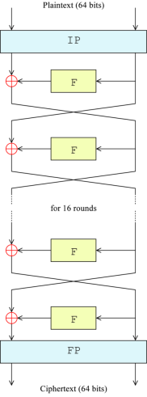

## DES加密算法C++实现
该程序使用C++14进行实现了DES加密算法。
### DES算法

| DES加密算法                                                 | DES子密钥生成算法                             |
| ----------------------------------------------------------- | --------------------------------------------- |
|  |  |

### 参考

- [DES supplementary material](https://en.wikipedia.org/wiki/DES_supplementary_material)
- [Data Encryption Standard](https://en.wikipedia.org/wiki/Data_Encryption_Standard)
